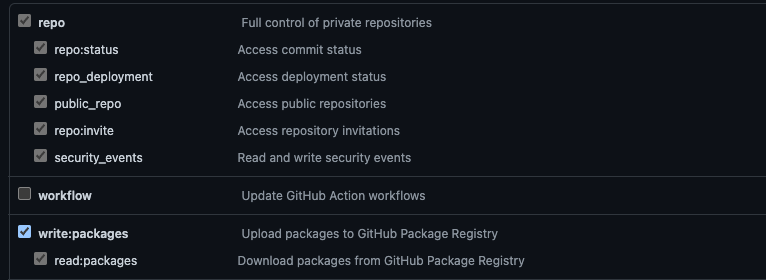

### Features

- [TypeScript](https://www.typescriptlang.org/) for static type checking
- [ESLint](https://eslint.org/) for code linting
- [Prettier](https://prettier.io) for code formatting
- [Changesets](https://github.com/changesets/changesets) for managing versioning and changelogs
- [GitHub Actions](https://github.com/changesets/action) for fully automated package publishing

### Github NPM Package Registry Publish
.github/workflows/release.yml
```bash
          cat << EOF > "./.npmrc"
            👇 YOUR USERNAME
            @YOUR_USERNAME:registry=https://npm.pkg.github.com
            //npm.pkg.github.com/:_authToken=$GH_REGISTRY_TOKEN
          EOF
```

### Github Personal Access Token
#### Select Scopes


### Github Registry Install
- 설치 할려는 repo 에서 .npmrc 를 생성 해주세요
```bash
npm install 
@YOUR_USERNAME:registry=https://npm.pkg.github.com
//npm.pkg.github.com/:_authToken=$GH_REGISTRY_TOKEN

yarn berry 
npmScopes:
  "YOUR_USERNAME":
    npmAlwaysAuth: true
    npmRegistryServer: "https://npm.pkg.github.com"
    npmAuthToken: "$GH_REGISTRY_TOKEN"

```